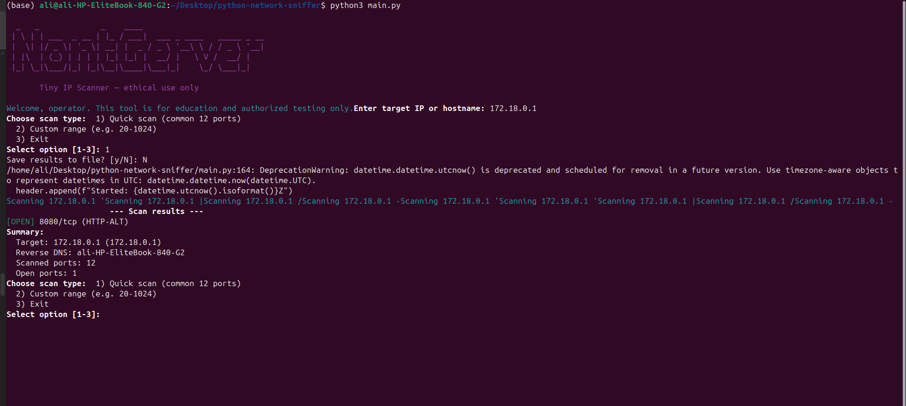

# 🕵️‍♂️ Python IP Scanner

A small, impactful **command-line IP scanner** Built entirely with Python’s standard library, it’s perfect for a basic cybersecurity project.

⚠️ **Ethical Notice**: Only use this tool on systems/networks you own or have explicit permission to test.

---

## ✨ Features
- Resolve hostnames to IP addresses (and reverse DNS lookup).
- Choose between:
  - **Quick Scan** → common 12+ ports
  - **Custom Range** → user-specified port range
- Simple banner grabbing from open ports.
- Colorized output and optional save-to-file.
- No external dependencies required.

---

## 🚀 How to Run
```bash
python3 main.py
```

Example:
```bash
$ python3 main.py

Enter target IP or hostname: scanme.nmap.org
```

---

## 📸 Screenshots

All screenshots should be placed inside the `images/` folder in your project root. Update or replace the sample file names below with your actual captures.


### 2. Quick Scan 


### 3. Custom Scan


---

## 📂 Project Structure
```
main.py           # Main application
README.md         # Documentation (this file)
images/           # Folder with screenshots (add your images here)
```

---

## 🛠️ Tech Stack
- **Language**: Python 3
- **Libraries**: Standard library only (socket, sys, time, threading, datetime)

---

## 🎯 Future Enhancements
- Multithreaded scanning for faster results
- Export results to JSON/HTML reports
- Add more built-in port/service fingerprints
- Optional stealth scan modes (SYN scan, etc.)

---

## ✅ Demo Summary
- Enter a target hostname/IP
- Select scan type
- Save results to a text file (optional)

---

## 👨‍💻 Author
Developed by **Ali Ahmed** as part of a cybersecurity learning project.
